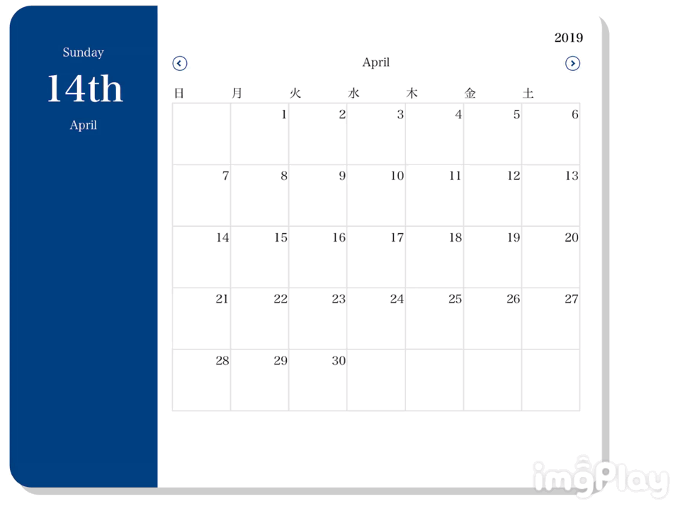

# Vue.js Calender
Vue.jsを使ってカレンダーを作成

## Description
`Vue.js` と `moment.js` を使ってカレンダーUIの作成をする。
機能は以下の3つ
* カレンダー表示
* 月を移動
* クリックに対応した日付を表示

## Demo

## Requirement
* Vue.js (v2.6.10)
* moment.js (v2.24.0)

## Author
[ogahiro21](https://github.com/ogahiro21)